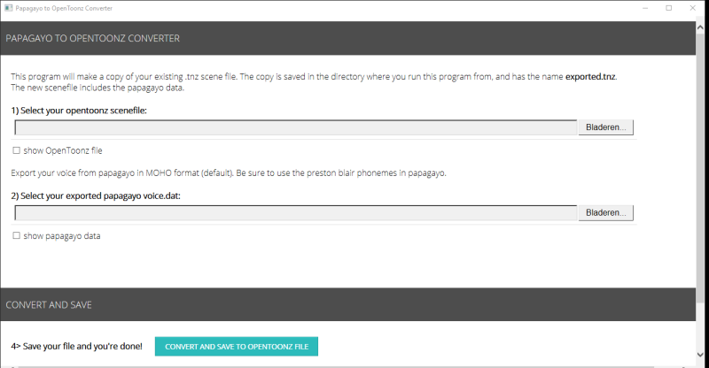

# opentoonz-papagayo.hta
Simple hta javascript gui that converts papagayo voices to a new opentoonz scenefile.

1> Select your opentoonz (template) file

2> Select your papagayo file

3> select the level(s) you want to insert the keyframes in. 

4> convert and save to new scenefile

I'm using an updated version of papagayo that has better language support. Get it here:
https://morevnaproject.org/papagayo/

Some animation footage made using this converter: 
https://youtu.be/4O1BLhU_a3Q 

